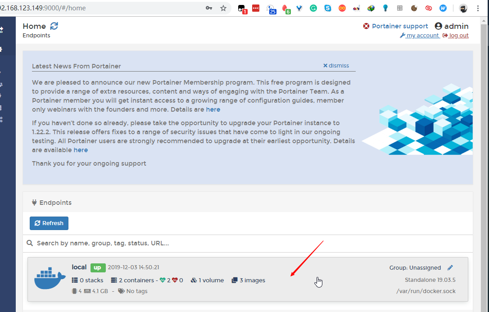
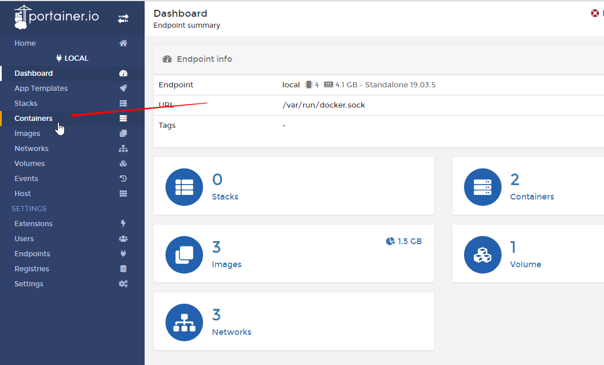
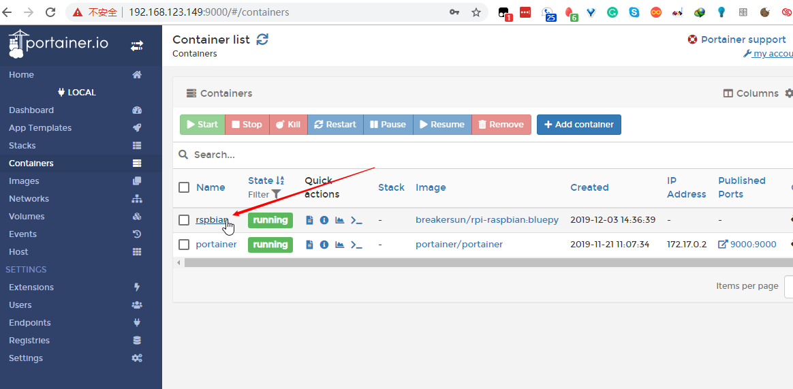
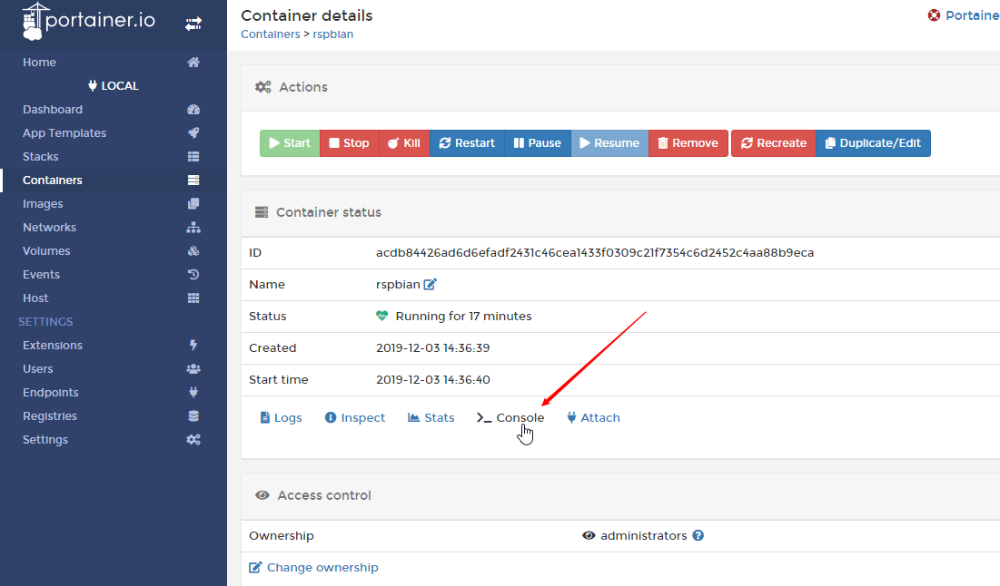
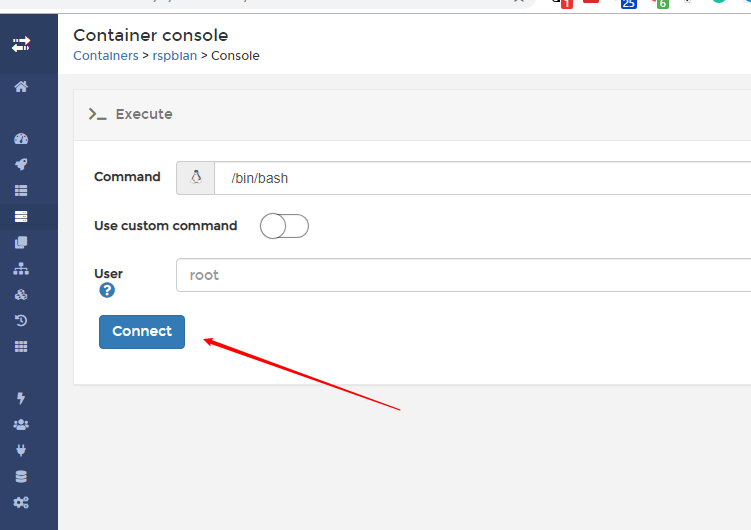

# 文档目标

演示如何使用BLE Scanner脚本，解析并记录iSite设备的beacon内容。

# 准备工作

- Raspberry Pi 联网，LAN IP地址已知
- PC与RPi处于同一局域网当中

# 操作步骤

1. PC使用浏览器访问RPi IP地址:9000

   - 账户：admin
   - 密码：raspberry

2. 登陆后找到raspbian docker

   

   

   

3. 进入raspbian docker的console界面

   

   

4. 执行相关指令

   cd /src/raspbian/

   | 指令                                 | 描述                                                         |
   | ------------------------------------ | ------------------------------------------------------------ |
   | python3 blescan.py 12:34:56:aa:bb:cc | 测试单个产品                                                 |
   | python3 blescan_uuid_log.py          | 测试多个产品，产品UUID必须为默认 并按照当前时间，生成log文件 |

5. 输出格式

   20191203-145817,a4:da:32:06:c9:cf,5de8c210-f981-4f11-8292-631f89450e40,00,00,100,000a,0007,bf,-86

   分别对应于：时间，MAC地址，UUID, hw version，sw version，电量百分比，Major，Minor，RSSI@1m， RSSI

6. 获取log文件

   访问ip:8081

   - 账号 admin
- 密码 admin
   
7. 托管抓log到后台

   由于上述执行命令，需要实时保持console的连接。

   提供一种可以让系统在后台抓log，不需要console连接的方法。

   首次执行：screen -R log

   执行抓log：python3 blescan_uuid_log.py 

   此时可以关闭console（ctrl + a， 再输入D），关闭后，系统仍然在抓log

   恢复会话：screen -r log

   此时可以看到抓log仍在执行，可以ctrl + c停止log

   然后使用#6步骤获得log文件